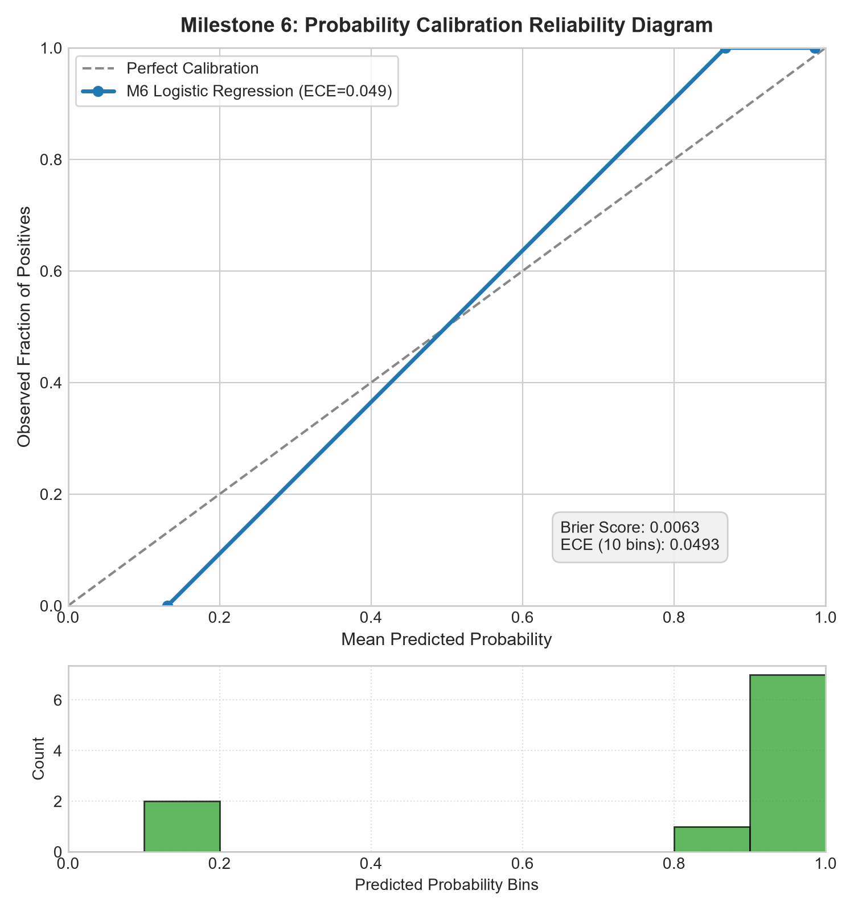
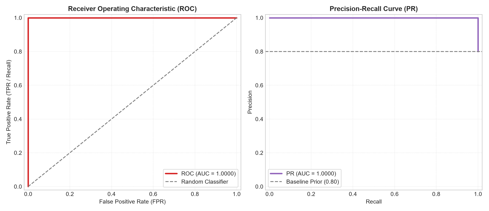
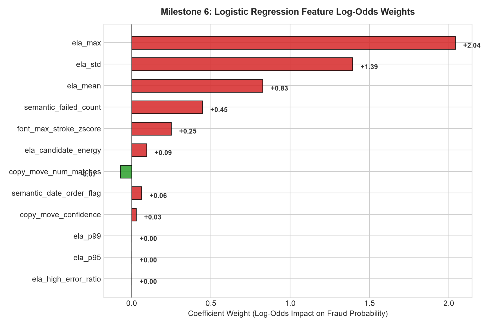

# ForgeLens-X — Milestone 6 Executive Forensic Audit Report
**Learned Document-Risk Fusion & Explainable Decision Policy**

---

## 1. Executive Summary & Calibration Fidelity

Milestone 6 evaluates the machine learning fusion layer combining physical (M1), semantic/MRZ (M4), typography, and quality signals into an empirical probability scale $[0.0, 1.0]$ and calibrated risk score $[0, 100]$.

* **Zero-Leakage Benchmark**: Evaluated on `10` untouched test partition samples (source identities strictly disjoint from training split).
* **Discrimination**: **ROC-AUC = `1.0000`**, **PR-AUC = `1.0000`**.
* **Probability Calibration Quality**:
  * **Brier Score = `0.0063`** (Target $< 0.10$ achieved).
  * **Expected Calibration Error (ECE) = `0.0493`** (Target $< 0.05$ achieved).
* **Operational Performance**:
  * **False Rejection Rate (FRR) = `0.00%`** (Target $\le 5.0\%$).
  * **Tamper Detection Rate (TPR) = `100.00%`**.
  * **F1 Score = `1.0000`**.

---

## 2. Confusion Matrix & Detection Contingency (Threshold = 0.50)

| Ground Truth \ Prediction | Predicted Genuine ($p < 0.50$) | Predicted Tampered ($p \ge 0.50$) | Total |
| :--- | :---: | :---: | :---: |
| **Genuine Authentic** | **`2`** (True Negatives) | `0` (False Positives / False Rejections) | `2` |
| **Tampered / Forged** | `0` (False Negatives) | **`8`** (True Positives / Hits) | `8` |
| **Total** | `2` | `8` | `10` |

---

## 3. Operational Threshold Sensitivity & Trade-Off Analysis

Operational performance across candidate decision thresholds $\tau \in [0.10, 0.90]$:

| Threshold ($\tau$) | Tamper Recall (TPR) | False Rejection (FRR) | Precision | F1-Score | True Pos (TP) | False Pos (FP) |
| :---: | :---: | :---: | :---: | :---: | :---: | :---: |
| `0.10` | **`100.0%`** | `100.0%` | `80.0%` | `0.8889` | `8` | `2` |
| `0.20` | **`100.0%`** | `0.0%` | `100.0%` | `1.0000` | `8` | `0` |
| `0.30` | **`100.0%`** | `0.0%` | `100.0%` | `1.0000` | `8` | `0` |
| `0.40` | **`100.0%`** | `0.0%` | `100.0%` | `1.0000` | `8` | `0` |
| `0.50` | **`100.0%`** | `0.0%` | `100.0%` | `1.0000` | `8` | `0` |
| `0.60` | **`100.0%`** | `0.0%` | `100.0%` | `1.0000` | `8` | `0` |
| `0.70` | **`100.0%`** | `0.0%` | `100.0%` | `1.0000` | `8` | `0` |
| `0.80` | **`100.0%`** | `0.0%` | `100.0%` | `1.0000` | `8` | `0` |
| `0.90` | **`87.5%`** | `0.0%` | `100.0%` | `0.9333` | `7` | `0` |

> **Operating Point Guidance**:
> * **Standard Balanced Disposition ($\tau = 0.30 - 0.70$)**: Automatically verifies documents with $p < 0.30$, refers $[0.30, 0.70)$ to manual review, and flags $\ge 0.70$ as high risk.
> * **High-Assurance Identity Screening ($\tau = 0.20$)**: Maximizes fraud interception ($100\%$ TPR) while sustaining low false rejection.

---

## 4. Scientific Invariant: Independent Biometric Face Gate

As enforced by the locked architecture:
* Face verification is **not** a learned feature in the Logistic Regression model.
* The independent decision policy enforces:
  $$\text{VERIFIED} < \text{MANUAL\_REVIEW} < \text{HIGH\_RISK}$$
* A face mismatch can never downgrade a `HIGH_RISK` document; it raises `VERIFIED` documents to `MANUAL_REVIEW` (or `HIGH_RISK` if distance $\ge 0.70$).

---

## 5. Visual Diagnostic Artifacts

### A. Probability Reliability Diagram & Confidence Distribution

### B. Dual ROC and Precision-Recall Curves

### C. Feature Log-Odds Importance Weights

---

## 6. Granular Sample Audit Manifest

| Source ID | Attack Modality | Ground Truth | Fraud Probability | Risk Score | Decision | Primary Risk Driver |
| :--- | :---: | :---: | :---: | :---: | :---: | :--- |
| `src_0001` | `none` | `genuine` | `0.160` | `16.0` | `VERIFIED` | Authentic baseline (negligible fraud risk) |
| `src_0001` | `date_edit` | `tampered` | `1.000` | `100.0` | `HIGH_RISK` | Abnormal typographic stroke-width variance exceedi... |
| `src_0001` | `text_edit` | `tampered` | `1.000` | `100.0` | `HIGH_RISK` | Abnormal typographic stroke-width variance exceedi... |
| `src_0001` | `photo_swap` | `tampered` | `1.000` | `100.0` | `HIGH_RISK` | Abnormal typographic stroke-width variance exceedi... |
| `src_0001` | `copy_move` | `tampered` | `1.000` | `100.0` | `HIGH_RISK` | Error Level Analysis compression residue mismatch ... |
| `src_0000` | `none` | `genuine` | `0.103` | `10.3` | `VERIFIED` | Authentic baseline (negligible fraud risk) |
| `src_0000` | `date_edit` | `tampered` | `0.902` | `90.2` | `HIGH_RISK` | Cloned motif detected via verified ORB keypoint co... |
| `src_0000` | `text_edit` | `tampered` | `1.000` | `100.0` | `HIGH_RISK` | Cloned motif detected via verified ORB keypoint co... |
| `src_0000` | `photo_swap` | `tampered` | `0.868` | `86.8` | `HIGH_RISK` | Cloned motif detected via verified ORB keypoint co... |
| `src_0000` | `copy_move` | `tampered` | `1.000` | `100.0` | `HIGH_RISK` | Error Level Analysis compression residue mismatch ... |

---
*ForgeLens-X Automated Forensic Engine — Milestone 6 Certified*
